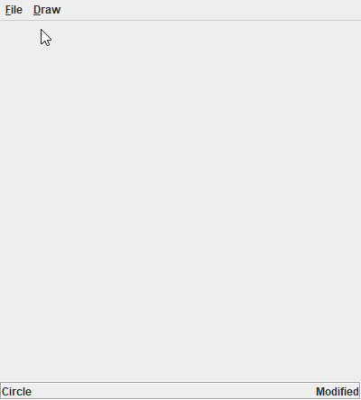

# Java Swing Drawing Application

## Description
This Java Swing application allows you to draw on a canvas, choose colors, and draw different figures such as lines and rectangles.

## Features
- **Draw on Canvas**: Click and drag to draw freehand lines.
- **Color Selection**: Choose colors from a color picker.
- **Draw Figures**: Draw shapes like rectangles and circles.
- **Save Drawings**: Save your drawings to a file
- **Open Drawings**: Open previously saved drawings from a file.

Here is a GIF demonstrating the features of the application:
<p align="left">
    
</p>

## Getting Started

### Prerequisites
- Java Development Kit (JDK) 8 or higher
- An IDE or text editor of your choice

### Installation
1. Clone the repository:
    ```sh
    git clone https://github.com/Guzillo/java-swing-drawing-app
    ```
2. Navigate to the project directory:
    ```sh
    cd java-swing-drawing-app
    ```
3. Open the project in your IDE.

### Running the Application
1. Compile the application:
    ```sh
    javac -d bin src\application\PaintApplication.java
    ```
2. Run the application:
    ```sh
    java -cp bin src\application\PaintApplication.java
    ```
